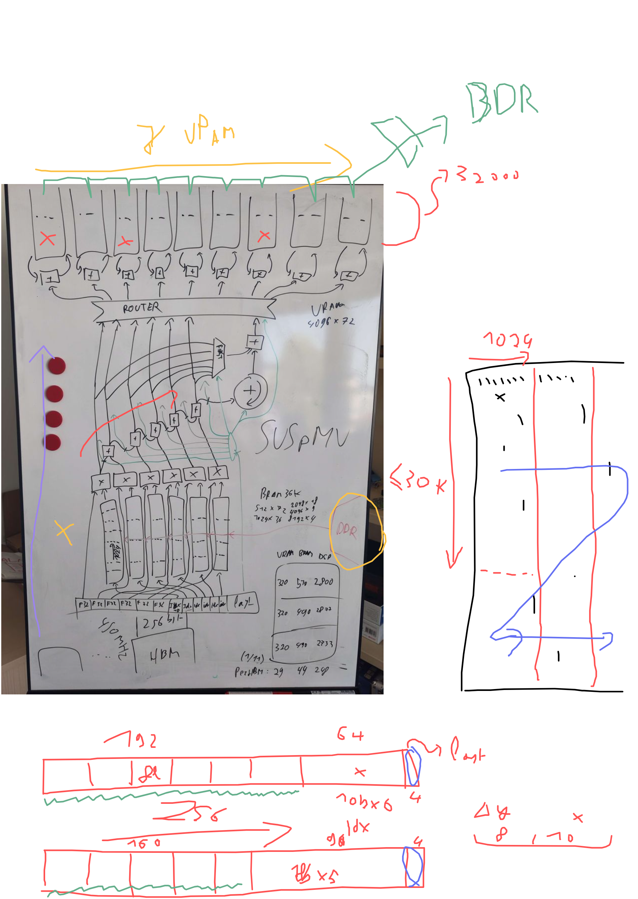

# SUSpMV

An innovative new Sparse Matrix-Vector multiply kernel written in SUS for Tapasco



## The Sparse Matrix Format:
The Sparse Matrix is encoded in blocks of 256 bit. Blocks come in two kinds: 
- 6 float: Stores 6 weights, and 6 10-bit x indices. Meant for denser parts of the matrix. 
- 5 float: Stores 5 weights, 5 10-bit x indices, and 5 8-bit y offsets. Used to bridge much sparser parts of the matrix. 

Each weight comes with an `is_last` flag, which is encoded differently for 6 float and 5 float, but in both formats, each element *can* carry it.

Semantically, the y value sum is computed by summing up the `weight * x_vals[x_index]` terms until and including each `is_last` value. 

To separate sections to target the next x block, or the next y block, you must emit a 5-float block with the `last_in_x`, `last_in_y` bit set respectively. 

## 6 float (for dense sections)
```
  256 bit [
    [  0..192] - 6 floats
    [192..252] - 6 10-bit x indices in reverse order
    [252..256] - is_last_extra bitset
  ]
  is_last_extra table:
    4'b0000: 6'b000000
    4'b0001: 6'b000001
    4'b0010: 6'b000010
    4'b0011: 6'b000100
    4'b0100: 6'b001000
    4'b0101: 6'b010000
    4'b0110: 6'b100000
    4'b0111: 6'b100001
    4'b1000: 6'b010001
    4'b1001: 6'b100010
    4'b1010: 6'b001001
    4'b1011: 6'b010010
    4'b1100: 6'b100100
    4'b1101: 6'b101000 // Some extra possibilities for a "last" first elem, because the deltas don't work to detect the first is_last. 
    4'b1110: 6'b110000
    4'b1111: Signifies 5 float mode
```
Equivalent to:
```c
struct Float6 {
  float[6] weights;
  uint64_t x_index_5 : 10;
  uint64_t x_index_4 : 10;
  uint64_t x_index_3 : 10;
  uint64_t x_index_2 : 10;
  uint64_t x_index_1 : 10;
  uint64_t x_index_0 : 10;
  uint64_t mode      : 4;
}
```
## 5 float (for sparse sections)
```
  256 bit [
    [  0..160] - 5 floats
    [160..200] - 5 8-bit y deltas
    [200]      - last_in_x
    [201]      - last_in_y
    [202..252] - 5 10-bit x indices in reverse order
    [252..256] - 4'b1111
  ]
```
Equivalent to:
```c
struct Float5 {
  float[5] weights;
  uint8_t y_delta0;
  uint8_t y_delta1;
  uint8_t y_delta2;
  uint8_t y_delta3;
  uint64_t y_delta4  : 8;
  uint64_t last_in_x : 1;
  uint64_t last_in_y : 1;
  uint64_t x_index_4 : 10;
  uint64_t x_index_3 : 10;
  uint64_t x_index_2 : 10;
  uint64_t x_index_1 : 10;
  uint64_t x_index_0 : 10;
  uint64_t mode      : 4; // == 4'b1111
}
```
`y_steps != 0` means that it `is_last`

### Extra constraints
- When crossing between `last_in_x` blocks, the same `y` index must not be written to twice in a row within 16 blocks. (This is because the latency for accumulating to y block URAMs is 15 cycles.)

## Authors
- Lennart Van Hirtum
- David Volz
